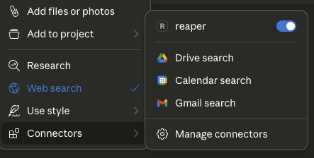
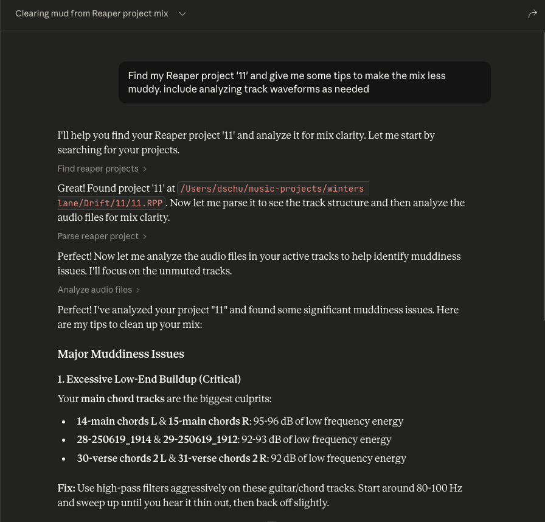

# Reaper MCP Server

This is an MCP server that connects Reaper projects to an MCP client like Claude Desktop, enabling you to ask questions about your projects and get comprehensive audio analysis for mixing feedback.

This server is read-only by design. It exposes no tools that lets AI modify your project. What it's good for is understanding what you've already made and learning how to improve it. Let AI suggest some ideas and you can try tweaking the knobs and understand how it affects your music by doing.

## Tools

### Project Discovery & Parsing

- **`find_reaper_projects`**: Finds all Reaper projects in the directory you specified in the config.
- **`parse_reaper_project`**: Parses a Reaper project file (.RPP) and returns detailed information including tempo, tracks, FX chains, and audio items.

  Each track carries its position and identity (`track_number` matching Reaper's display order, `guid`), its routing (`is_folder`/`folder_depth`, `main_send`, `receives`, `num_channels`, `midi_hardware_out`), and its mixer state (`volume`, `pan`, `mute`, `solo`). Each item carries `position`, `length`, `start_offset`, `playrate`, `mute`, fades, and every take — with the active take marked, since that is the one that plays.

  `receives` entries name the source track by index and by name, which is what distinguishes a live signal path from a leftover track: a track with `main_send: false` does not reach the master, and its audio is only audible through whatever receives from it.

These tools work in tandem. When you ask Claude a question about a specific Reaper project, it will use the `find_reaper_projects` tool to find the project, then use the `parse_reaper_project` tool to parse the project and answer your question.

### Installed FX Discovery

- **`list_installed_fx(plugin_type=None, search_query=None)`**: Lists all installed FX/plugins available in Reaper.

  **Parameters:**
  - `plugin_type` (optional): Filter by plugin type (VST2, VST3, AU, JS, CLAP)
  - `search_query` (optional): Search plugins by name, manufacturer, or type

  **Returns:** List of installed plugins including:
  - Plugin name
  - Plugin type (VST2, VST3, AU, JS, CLAP)
  - File path
  - Manufacturer (when available)

  **Example Questions:**
  - "What synth plugins do I have installed?"
  - "Show me all my Waves plugins"
  - "I'm looking for a warbly synth. What options do I have from my already installed plugins?"
  - "List all my VST3 plugins"
  - "Do I have any reverb plugins?"
  - "What iZotope plugins do I have?"
  - "Show me all my Audio Unit plugins"

  **Note:** This tool scans your Reaper plugin cache files. If you recently installed new plugins and haven't scanned them in Reaper yet, they won't appear in the results. Make sure to open Reaper and let it scan for new plugins first.

### Audio Analysis

- **`analyze_audio_files(project_path, track_filter=None, whole_file=False)`**: Analyzes the audio in a Reaper project for mixing feedback.

  **Parameters:**
  - `project_path` (required): Path to the .RPP project file
  - `track_filter` (optional): Filter tracks by name (e.g., "Vocal" to analyze only vocal tracks)
  - `whole_file` (optional): Analyze entire source files instead of only the region each item plays. Off by default.

  **Returns:** Comprehensive audio analysis including:

  - **Level Analysis**: Peak levels, RMS, clipping detection, DC offset
  - **Frequency Analysis**: Spectral centroid, and each band's share of total energy
  - **Stereo Imaging**: Stereo width, phase coherence, mono compatibility
  - **Dynamic Range & Loudness**: LUFS (loudness standards), true peak, crest factor

  **Example Questions:**
  - "Analyze all audio in my Rock Song project"
  - "Check the vocal tracks for clipping"
  - "Is my mix too loud for streaming platforms?"
  - "Are there any phase issues in my drum tracks?"

  **What is measured:** By default each item is analyzed over exactly the region it plays — its source start offset, length, and playrate — not its whole source file. Distinct regions are analyzed once and reused, so an item repeated across the arrangement costs one measurement. MIDI items have no audio source and are listed under `skipped` rather than reported as errors.

  **Frequency figures are relative.** Each band is reported as a share of that region's total spectral power (and the same share in dB). Absolute band energy scales with clip length, which makes a long file look tens of dB "hotter" than a short one of identical material and makes cross-file comparison meaningless.

  **These numbers are pre-FX.** Analysis reads the source files from disk, so it reflects neither the track's FX chain nor its fader. On a track running an amp sim or heavy EQ, the analysis describes the raw DI, not what you hear. Every response is labelled `signal_stage: pre-fx`.

  **Warning Thresholds:**
  - Peak > -0.3 dBFS: Risk of clipping
  - Clipping detected: Digital distortion present
  - 200–500 Hz more than 10 dB above 500–2000 Hz: Boxy low mids. Comparing these two bands to each other, rather than one band against the whole spectrum, is what keeps a bass part from being flagged simply for being a bass.
  - Mean sample value > 0.001: DC offset
  - Phase coherence < 0.5: Phase cancellation issues
  - LUFS > -8: Too loud for streaming (Spotify target: -14 LUFS)
  - Crest factor < 6 dB: Possibly over-compressed

  Loudness is reported as `null` rather than a stand-in value when it cannot be measured (regions shorter than 400 ms), and regions under 50 ms are measured but not warned about.

To see all data structures parsed from projects, check out the `src/reaper_mcp_server/reaper_dataclasses.py` file.

## Setup

1. **Install Dependencies**
   ```bash
   uv venv
   source .venv/bin/activate

   uv pip install .
   ```

2. **Configure Claude Desktop**
   - Follow [the instructions to configure Claude Desktop](https://modelcontextprotocol.io/quickstart/server#core-mcp-concepts) for use with a custom MCP server
   - Find the sample config in `setup/claude_desktop_config.json`
   - Update the following paths in the config:
     - Your `uv` installation path
     - Your Reaper project directory
     - This server's directory

3. **Launch and Configure**
   - Open Claude Desktop
   - Click the '+' icon on the chat box
   - Click on 'Connectors' and you should see the 'reaper' connector enabled

   

4. **Ask Away!**
   - Ask questions about your Reaper project
   - Always include the name of the specific Reaper project you're asking about
   - You can expand the tool boxes to see the raw project data being passed to Claude
   
